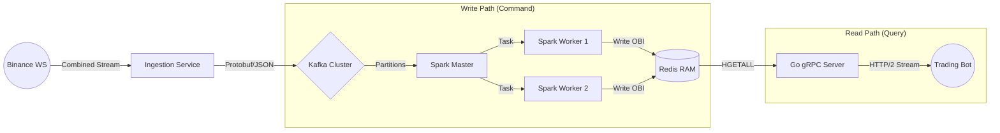

# ⚡ QuantCore Engine

**Distributed Digital Asset Market Data Pipeline**

     

**QuantCore Engine** is a high-frequency trading (HFT) data pipeline capable of ingesting, processing, and serving real-time market microstructure signals. It calculates **Order Book Imbalance (OBI)** for top crypto assets with sub-second end-to-end latency.

The system is engineered using a **Kappa Architecture** for streamlined stream processing and implements a **CQRS Pattern** to decouple high-throughput computation from low-latency serving.

---

## 🚀 Key Features

- **Real-Time Market Microstructure:** Calculates **Order Book Imbalance (OBI)** ($\frac{V_b - V_a}{V_b + V_a}$) to predict short-term price pressure using L2 Depth data.
- **Distributed Stream Processing:** Utilizes **Apache Spark Structured Streaming** to process nested JSON arrays of Order Books using vectorized higher-order functions.
- **High-Performance Ingestion:** Python producer multiplexes 10+ WebSocket streams into a single connection, sharding data into **Kafka Partitions** to guarantee strict ordering per symbol.
- **gRPC Streaming API:** Go server pushes updates to clients via **HTTP/2** server-side streaming, reducing network overhead compared to REST polling.
- **Fault Tolerance:** Fully containerized environment with Zookeeper-managed Kafka brokers and auto-healing Spark workers.

---

## 🏗 Architecture



---

## 📐 Architectural Patterns

### 1. Kappa Architecture

Unlike the Lambda architecture (which requires separate Batch and Speed layers), QuantCore treats the data stream as the single source of truth.

- **Stream-First:** All processing, whether real-time or historical replay, is handled by the same **Spark Structured Streaming** codebase.
- **Log-Based:** Kafka acts as the immutable log. Replaying history is achieved simply by resetting Kafka consumer offsets, eliminating the need for a separate data lake for simple signal generation.

### 2. CQRS (Command Query Responsibility Segregation)

The system strictly separates the **Write Model** (Ingestion/Compute) from the **Read Model** (Serving) to optimize for conflicting requirements.

- **Command Side (Write):** Handles high-throughput math (10k+ events/sec) using Spark. Optimized for **Throughput**.
- **Query Side (Read):** Handles client requests using Go/Redis. Optimized for **Latency**.
- **The Bridge:** Redis acts as the materialized view, allowing the Go API to serve data in microseconds without being blocked by the heavy computational load of the Spark engine.

---

## ⚙️ Deep Dive: Distributed Parallelism

One of the core engineering challenges in HFT is processing massive data volumes without losing the strict chronological order of trades. QuantCore solves this using a **Partition-Aware Streaming Strategy**.

### 1. The Router (Python Producer)

The Ingestion service acts as a semantic router. It tags every incoming Order Book update with a **Partition Key** equal to its Symbol (e.g., `key="BTCUSDT"`).

### 2. The Buffer Lanes (Kafka Partitions)

The Kafka Broker routes messages using a consistent hashing algorithm on the Symbol key.

- Strict Ordering: All updates for a specific symbol (e.g., BTCUSDT) are guaranteed to land in the same partition.
- Load Balancing: With 10 partitions and 2 Spark Workers (5 cores each), the workload is distributed evenly. Each Worker consumes roughly 5 partitions in parallel.

### 3. The Parallel Workers (Spark Executors)

The **Spark Master** negotiates resources and assigns **Executors** (Tasks) to consume specific Kafka partitions.

- By configuring **10 Kafka Partitions** and **10 Spark Cores**, the system achieves a **1:1 Concurrency Ratio**.
- **Result:** BTC processing never blocks ETH processing. The system scales horizontally; to handle 100 more symbols, we simply add more Partitions and Workers.

---

## 🧠 System Design Decisions

### 1. Why Redis instead of DynamoDB?

For the "Hot Path" (Live Ticker), latency is the primary constraint.

- **Redis (RAM):** Provides **~200µs** read latency via persistent TCP sockets. Ideal for the "Current State" scoreboard pattern where history is irrelevant.
- **DynamoDB (Disk/HTTP):** Incurs **~5-10ms** latency due to HTTPS overhead and disk I/O. Reserved for the "Cold Path" (Historical Archival) for future expansion.

### 2. Why gRPC instead of REST?

The consumption pattern for market data is **Streaming**, not Request-Response.

- **REST:** Clients must poll (`GET /price`) repeatedly. This creates "Thundering Herd" problems and wastes bandwidth on HTTP headers.
- **gRPC:** Allows for **Bi-Directional Streaming**. The client connects once, and the server pushes binary **Protobuf** updates continuously. This reduces payload size by ~60% and CPU usage for parsing.

### 3. Why Kafka?

Acts as the **Shock Absorber** between the volatile data source (Binance) and the processing engine (Spark).

- **Backpressure:** Prevents the ingestion layer from crashing if the compute layer slows down during market spikes.
- **Parallelism:** Hashes symbols to specific partitions, allowing Spark workers to process BTC and ETH in parallel without race conditions.

---

## 🛠️ Installation & Setup

### Prerequisites

- Docker & Docker Compose
- Go 1.21+
- Python 3.11+

### 1. Start Infrastructure

Boot up the "Virtual Data Center" (Zookeeper, Kafka, Spark, Redis).

```bash
docker-compose up -d
```

### 2. Configure Kafka

Force creation of the topic with 10 partitions to enable parallel processing by symbol.

```bash
docker exec -it kafka kafka-topics --create \
    --topic order_book \
    --bootstrap-server localhost:9092 \
    --partitions 10 \
    --replication-factor 1
```

### 3. Start Ingestion (Python)

Connects to Binance and feeds Kafka.

```bash
# Create venv and install dependencies
python3 -m venv venv
source venv/bin/activate
pip install -r requirements.txt

# Run Producer
./venv/bin/python ingestion/producer.py
```

### 4. Start Processing (Spark)

Submits the job to the Spark Cluster. Note that we execute this _inside_ the container as the root user to handle JAR permissions.

```bash
docker exec -u 0 -it spark-master /opt/spark/bin/spark-submit \
  --packages org.apache.spark:spark-sql-kafka-0-10_2.12:3.5.0 \
  --master spark://spark-master:7077 \
  /app/stream/stream_processor.py
```

### 5. Start Serving (Go gRPC)

Launch the API server.

```bash
cd api
go run main.go
```

### 6. Run Client (Test)

Connect a dummy client to verify the stream.

```bash
cd api
go run client/main.go
```

---

## 📂 File Structure

```text

├── api/                        # Serving Layer (Go gRPC)
│   ├── client/                 # Test gRPC Client
│   ├── proto/                  # Protobuf Contracts
│   ├── main.go                 # Server Entrypoint
│   ├── go.mod                  # Go Module Definition
│   └── go.sum                  # Dependency Checksums
├── ingestion/                  # Ingestion Layer (Python)
│   └── producer.py             # Binance WebSocket -> Kafka
├── stream/                     # Compute Layer (PySpark)
│   └── stream_processor.py     # Kafka -> OBI Math -> Redis
├── docker-compose.yml          # Infrastructure Orchestration
├── requirements.txt            # Python Dependencies
└── README.md                   # System Documentation
```

---

## 📜 License

MIT License.
