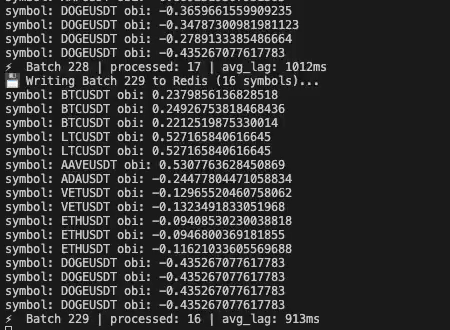

# ⚡ QuantCore Engine

**Distributed Digital Asset Market Data Pipeline**

     

**QuantCore Engine** is a streaming data pipeline that ingests, processes, and serves **real-time** market microstructure signals. It calculates **Order Book Imbalance (OBI)** for the **Top 30 crypto assets** with sub-second end-to-end latency.

The system uses a **Kappa-style architecture** where Kafka is the single source of truth, with a **Speed Layer + Serving Layer** separation: Spark handles high-throughput stream computation, while Redis + a Go gRPC server deliver low-latency event-driven push to clients.

---

## 🚀 Key Features

- **Real-Time Market Microstructure**: Computes **Order Book Imbalance (OBI)** ($\frac{V_b - V_a}{V_b + V_a}$) on L2 depth snapshots to predict short-term price pressure.
- **Distributed Stream Processing**: **Apache Spark Structured Streaming** processes nested order book arrays using vectorized **Higher-Order Functions** (`aggregate` + `transform`) to avoid shuffle.
- **Driver-Side Dedup Optimization**: Driver-side Python dict dedup bypasses Spark shuffle entirely, reducing Redis writes per batch by **76% (108 → 26 rows)** over 10K+ batches.
- **Sharded Ingestion**: Python producer is horizontally sharded into **10 parallel processes**, each subscribing to a slice of the symbol universe to overcome single-WebSocket subscription limits.
- **Event-Driven gRPC Streaming**: Go server uses **Redis Pub/Sub** to push updates over **HTTP/2 server-side streaming**, eliminating polling staleness — server-side latency p50 dropped from **321ms → 5ms (-98%)** vs the polling baseline.
- **Protobuf Encoding**: Reduces application payload size by **46% (1169B → 630B)** vs JSON, measured on a 30-symbol `MarketUpdate` message.
- **Cloud-Native Deployment**: Fully provisioned to AWS EC2 via **Terraform** with `user_data` bootstrap.



---

## 🏗 Architecture

```text
DATA SOURCE         INGESTION LAYER          BUFFER LAYER
+-------------+     +------------------+     +----------------------+
| Binance WS  | --> | Python Producer  | --> | Apache Kafka         |
| (L2 Depth)  |     | (10 Sharded Procs)|    | (30 Partitions)      |
+-------------+     +------------------+     +----------------------+
                                                        |
                                                        v
                                             COMPUTE LAYER (WRITE)
                                             +-----------------------+
                                             | Apache Spark Cluster  |
                                             | (Structured Stream)   |
                                             | - OBI via HOF (no     |
                                             |   shuffle)            |
                                             | - Driver-side dict    |
                                             |   dedup               |
                                             +-----------------------+
                                                        |
                                          HSET + PUBLISH (atomic pipeline)
                                                        v
SERVING LAYER (READ)                         STORAGE LAYER
+----------------------+   gRPC (HTTP/2)     +----------------------+
| Go gRPC API Server   | <------------------ | Redis (In-Memory)    |
| (Server Streaming)   |   SUBSCRIBE         | - market_metrics     |
|                      |   (Pub/Sub)         | - market_updates ch  |
+----------------------+                     +----------------------+
           |
           v
    +-------------+
    | Trading Bot |
    | (Client)    |
    +-------------+
```

---

## 📐 Architectural Patterns

### 1. Kappa Architecture (Stream-First)

The system treats the live data stream as the primary system of record, eliminating the need for batch reconciliation.

- **Single Source of Truth**: Kafka is an immutable event log. Historical reprocessing is achieved by spawning a new consumer group from `offset 0`.
- **Continuous Computation**: Spark Structured Streaming incrementally computes metrics in micro-batches. No nightly batch jobs required.
- **State Management**: Redis maintains the current market state as a materialized view, decoupling read latency from write throughput.

### 2. Speed Layer + Serving Layer Separation

The system separates high-throughput computation from low-latency serving:

- **Compute Side**: Apache Spark processes ~300 msg/sec of order book updates with vectorized HOF, avoiding unnecessary shuffles.
- **Serving Side**: Redis (in-memory KV) and Go gRPC API serve clients in milliseconds, not blocked by Spark's micro-batch latency.
- **Bridge**: Spark writes both an `HSET` (state snapshot) and `PUBLISH` (event notification) within the same Redis pipeline, ensuring atomic-ish state updates.

### 3. Infrastructure as Code (IaC)

The deployment environment is provisioned via **Terraform**.

- **Single-Node Deployment**: Provisions an `m5.xlarge` EC2 instance with security groups and pulls the full docker-compose stack via `user_data` bootstrap.
- **Note**: This is a simplified deployment intended for demo / single-environment use. Production-grade improvements (Packer-baked AMIs, custom VPC, modularization, S3 backend for state, managed services like MSK / ElastiCache) are documented as future work.

---

## ⚙️ Deep Dive: Distributed Parallelism

A core engineering challenge in market data processing is achieving high throughput while preserving strict per-symbol chronological order. QuantCore solves this with a **Partition-Aware Streaming Strategy** scaled across 30 symbols.

### 1. Horizontal Ingestion Sharding

A single Python producer cannot subscribe to all 30 WebSocket streams reliably (Binance enforces a per-connection subscription limit). The ingestion layer is therefore horizontally sharded:

- **Strategy**: 10 producer processes launched via `run.sh`, each receiving a `SHARD_ID` env var that maps to a slice of the symbol universe (`SYMBOLS[start:end]` via `math.ceil`).
- **Effect**: Parallel WebSocket I/O and JSON parsing across multiple processes before data reaches Kafka.

### 2. Kafka Partitioning by Symbol Key

Kafka routes messages using consistent hashing on the `symbol` key:

- **Strict Per-Symbol Ordering**: All updates for `BTCUSDT` land in the same partition, processed sequentially by the same consumer.
- **Concurrency**: 30 partitions provide one logical lane per asset, enabling Spark to process all symbols in parallel without cross-symbol contention.

### 3. Spark Resource Alignment (2 Workers × 15 Cores = 30 Cores)

Spark resources are deliberately tuned to match the Kafka partition count for **1:1 partition-to-core mapping**:

- **30 partitions × 30 cores** = no task queueing, every partition has a dedicated processing slot.
- **2 workers** for fault isolation: a single worker failure leaves the system at 50% capacity instead of full outage.
- **15 cores per executor** intentionally exceeds Spark's official 3-5 cores/executor guidance. That guidance applies to HDFS / S3 workloads where NameNode metadata coordination becomes a bottleneck above ~5 concurrent I/O threads. Since QuantCore uses Kafka (per-partition independent threads) and Redis (in-memory + pipelined writes), neither bottleneck applies.

---

## 🧠 System Design Decisions

### 1. Why Higher-Order Functions Instead of `explode + groupBy`?

The naive approach to summing bid/ask volumes would be `explode(bids) → groupBy(symbol) → sum(qty)`. This triggers a **Spark shuffle** — moving data across executors over the network — which is one of the most expensive operations in distributed processing.

QuantCore uses **Spark SQL Higher-Order Functions** (`aggregate` + `transform`) to compute volume sums **within a single row**, since each Kafka message already contains a self-contained order book snapshot. This eliminates the shuffle entirely. The HOF approach also avoids JVM↔Python serialization overhead inherent to Python UDFs.

### 2. Why Driver-Side Dict Dedup Instead of `groupBy().agg(last())`?

When Spark falls behind the producer (e.g., during market spikes), a single micro-batch may contain multiple updates for the same symbol. After Spark's parallel computation and `collect()` to the driver, the order is no longer guaranteed, leading to a potential **ordering bug** where stale OBI values overwrite newer ones in Redis.

The natural fix would be `groupBy(symbol).agg(last(OBI))` — but this triggers another shuffle. Since the post-aggregation dataset is small (~30-150 rows) and already collected to the driver, an **in-memory Python dict on the Spark driver** dedups in O(n) without invoking Spark's distributed execution at all.

This reflects a broader principle: **distributed tools have fixed coordination overhead; for small datasets, single-machine solutions can outperform them**.

Measured impact (10K+ batches): Redis writes per batch reduced from 108 to 26 rows (-76%); Spark-side latency p95 reduced 32% (1472ms → 1008ms).

### 3. Why Event-Driven Pub/Sub Instead of Polling?

The original gRPC server polled Redis every 500ms (`HGETALL` + `stream.Send` + `sleep`). Even though the API surface was streaming, the internal polling introduced an average **250ms artificial staleness** (half of the polling interval) plus tail-latency accumulation when polling ticks misaligned with Spark batch ticks.

The refactor uses **Redis Pub/Sub**: Spark writes to Redis and `PUBLISH`es to `market_updates_channel` in the same pipeline; the gRPC server `SUBSCRIBE`s and pushes to clients on every notification.

Measured impact (80K+ messages, two-layer latency decomposition):

| Layer                         | Polling                    | Event-Driven           | Improvement     |
| ----------------------------- | -------------------------- | ---------------------- | --------------- |
| Spark side (control variable) | p50 698ms                  | p50 674ms              | unchanged ✓     |
| **Server side (the win)**     | **p50 321ms / p99 1616ms** | **p50 5ms / p99 24ms** | **-98% / -99%** |
| End-to-end                    | p50 1014ms / p99 2506ms    | p50 681ms / p99 1219ms | -33% / -51%     |

### 4. Why gRPC Instead of REST?

Market data consumption is fundamentally **streaming**, not request-response.

- **REST**: Clients must repeatedly poll, creating connection overhead, redundant headers, and bandwidth waste on JSON's verbose encoding.
- **gRPC**: HTTP/2 multiplexing with **server-side streaming** — clients subscribe once, the server pushes continuously. **Protobuf binary encoding reduces payload size by 46%** (measured: 1169B → 630B per `MarketUpdate`) compared to equivalent JSON.

### 5. Why Redis Instead of a Disk Database?

For real-time serving, latency is the primary constraint.

- **Redis (RAM)**: Sub-millisecond reads, hash data structure maps cleanly to symbol → metric lookups, and Pub/Sub provides a natural event notification primitive.
- **Disk databases** (Postgres, DynamoDB): Typically tens-of-milliseconds latency due to disk I/O and network/HTTP overhead — unacceptable for streaming market signals.

### 6. Why Kafka?

Kafka acts as the **shock absorber** between the volatile data source and the processing engine:

- **Backpressure**: Decouples ingestion speed from compute speed. Producer doesn't crash if Spark slows down during market spikes.
- **Replay**: As an immutable log, Kafka enables historical reprocessing simply by spawning a new consumer group from `offset 0` — the foundation of Kappa architecture.
- **Per-Symbol Ordering**: Hash partitioning by symbol ensures all `BTCUSDT` events land in the same partition, processed in strict order by a single consumer.

---

## 🛠️ Installation & Setup (Local)

### Prerequisites

- Docker & Docker Compose
- Go 1.21+
- Python 3.11+
- Terraform
- AWS CLI (configured)

### 1. Start Infrastructure

Boot up the "Virtual Data Center" (Zookeeper, Kafka, Spark, Redis).

```bash
docker-compose up -d
```

### 2. Configure Kafka

Force creation of the topic with **30 partitions** to enable parallel processing for the Top 30 symbols.

```bash
docker exec -it kafka kafka-topics --create \
    --topic order_book \
    --bootstrap-server localhost:9092 \
    --partitions 30 \
    --replication-factor 1
```

### 3. Start Ingestion (Python)

Connects to Binance and feeds Kafka.

```bash
# Create venv and install dependencies
python3 -m venv venv
source venv/bin/activate
pip install -r requirements.txt

# Run Producer
./venv/bin/python ingestion/producer.py
```

### 4. Start Processing (Spark)

Submits the job to the Spark Cluster. Note that we execute this _inside_ the container as the root user to handle JAR permissions.

```bash
docker exec -u 0 -it spark-master /opt/spark/bin/spark-submit \
  --packages org.apache.spark:spark-sql-kafka-0-10_2.12:3.5.0 \
  --master spark://spark-master:7077 \
  /app/stream/stream_processor.py
```

### 5. Start Serving (Go gRPC)

Launch the API server.

```bash
cd api
go run main.go
```

### 6. Run Client (Test)

Connect a dummy client to verify the stream.

```bash
cd api
go run client/main.go
```

---

## 🛠️ Installation & Setup (Cloud)

### Cloud Deployment (AWS + Terraform)

Deploy the entire stack to a dedicated AWS EC2 instance automatically.

1. **Initialize Terraform:**

   ```bash
   cd infra
   terraform init
   ```

2. **Deploy Infrastructure:**

   ```bash
   terraform apply
   ```

   _(This provisions an `m5.xlarge` instance, installs Docker, clones the repo, and starts the cluster via User Data scripts.)_

3. **Start Ingestion (Sharded):**
   Use the helper script to launch 10 parallel producers.

   ```bash
   # Inside the server or local machine
   cd ingestion
   ./run.sh
   ```

4. **Teardown:**

   ```bash
   terraform destroy
   ```

---

## 📂 File Structure

```text
.
├── api/                        # Serving Layer (Go gRPC)
│   ├── client/                 # Test gRPC Client
│   ├── proto/                  # Protobuf Contracts
│   └── main.go                 # Server Entrypoint
├── infra/                      # Infrastructure as Code
│   └── main.tf                 # Terraform AWS Definition
├── ingestion/                  # Ingestion Layer (Python)
│   ├── producer.py             # Binance WebSocket -> Kafka
│   └── run.sh                  # Helper script to launch sharded producers
├── stream/                     # Compute Layer (PySpark)
│   └── stream_processor.py     # Kafka -> OBI Math -> Redis
├── docker-compose.yml          # Local Orchestration
├── Dockerfile                  # Custom Spark Image with Dependencies
├── requirements.txt            # Python Dependencies
└── README.md                   # System Documentation
```

---

## 📜 License

MIT License.
